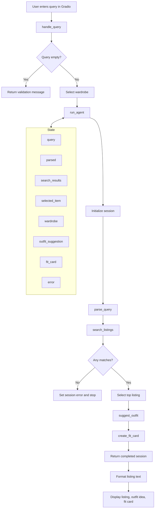

# FitFindr — planning.md

## Project summary

FitFindr is a multi-tool AI shopping assistant for secondhand fashion. A user describes an item they want, the agent searches a small mock resale dataset, chooses the strongest listing, suggests how to style it with the user's existing wardrobe, and generates a short shareable fit card/caption.

The goal is not to replace a full ecommerce search engine. The goal is to demonstrate a clear planning loop with explicit tools, state passing, edge-case handling, and a working user interface.

---

## Tools

### Tool 1: search_listings

**What it does:**
Searches the mock secondhand listings dataset for items matching the user's request. It filters by optional size and maximum price, then scores remaining listings by keyword overlap against the user's description.

**Input parameters:**
- `description` (str): The search phrase extracted from the user query, such as `"vintage graphic tee"` or `"black combat boots"`.
- `size` (str | None): Optional size constraint, such as `"M"`, `"US 8"`, or `"W30"`. Matching is case-insensitive and flexible enough to match values like `"S/M"`.
- `max_price` (float | None): Optional price ceiling. Listings above this amount are removed.

**What it returns:**
A list of listing dictionaries sorted by relevance. Each result contains the dataset fields: `id`, `title`, `description`, `category`, `style_tags`, `size`, `condition`, `price`, `colors`, `brand`, and `platform`. Returns an empty list when no listing matches.

**What happens if it fails or returns nothing:**
The agent stores an error message in session state and stops early. It does not call the outfit or fit-card tools with missing listing data.

---

### Tool 2: suggest_outfit

**What it does:**
Given the selected listing and the user's wardrobe, suggests practical outfit combinations. When a Groq API key is available, it asks an LLM for natural styling advice. When no key is available, it uses a deterministic fallback so the app still works locally.

**Input parameters:**
- `new_item` (dict): The selected listing from `search_listings`.
- `wardrobe` (dict): A wardrobe object with an `items` list. Each item includes name, category, colors, style tags, and optional notes.

**What it returns:**
A non-empty string containing 1–2 outfit suggestions. With an example wardrobe, it references specific wardrobe items by name. With an empty wardrobe, it gives general styling advice for what to pair with the item.

**What happens if it fails or returns nothing:**
If the wardrobe is empty, the tool returns general advice instead of failing. If the LLM call fails, the deterministic fallback returns a usable suggestion. If `new_item` is missing, the tool returns a clear error string.

---

### Tool 3: create_fit_card

**What it does:**
Creates a short, shareable outfit caption for the thrifted find. It mentions the item, price, platform, and overall outfit vibe.

**Input parameters:**
- `outfit` (str): The outfit suggestion produced by `suggest_outfit`.
- `new_item` (dict): The selected listing from `search_listings`.

**What it returns:**
A 2–4 sentence caption that sounds casual and social-media ready. It is designed for an OOTD or thrift-find post.

**What happens if it fails or returns nothing:**
If the outfit text is empty or the item data is incomplete, it returns a helpful error string instead of raising an exception. If the LLM call fails, a deterministic caption fallback is used.

---

### Additional Tool: parse_query

**What it does:**
Extracts structured search parameters from natural language before the agent calls `search_listings`.

**Input parameters:**
- `query` (str): The raw user request.

**What it returns:**
A dictionary with:
- `description` (str): Query text with size and price phrases removed.
- `size` (str | None): Extracted size constraint.
- `max_price` (float | None): Extracted maximum price.

**What happens if it fails or returns nothing:**
If parsing cannot identify a size or price, those fields remain `None`. If the cleaned description is empty, the original query is used as the description.

---

## Planning Loop

**How does your agent decide which tool to call next?**

The planning loop is linear with early exits for errors:

1. Initialize a new session dictionary with the original query, wardrobe, empty tool results, and `error=None`.
2. Parse the query into `description`, `size`, and `max_price`.
3. Call `search_listings(description, size, max_price)`.
4. If search returns no results, set `session["error"]` to a helpful message and return immediately.
5. Select the top result from the sorted results list and store it as `session["selected_item"]`.
6. Call `suggest_outfit(selected_item, wardrobe)`.
7. If outfit generation somehow returns an empty string, set an error and return early.
8. Call `create_fit_card(outfit_suggestion, selected_item)`.
9. Return the completed session.

The agent knows it is done when either an error is set or all three outputs exist: selected item, outfit suggestion, and fit card.

---

## State Management

**How does information from one tool get passed to the next?**

The agent uses a session dictionary as the single source of truth for one interaction. It stores:

- `query`: Original user input.
- `parsed`: Structured search parameters from the query.
- `search_results`: All matching listings returned by `search_listings`.
- `selected_item`: The top listing selected for styling.
- `wardrobe`: The user's selected wardrobe data.
- `outfit_suggestion`: Text returned by `suggest_outfit`.
- `fit_card`: Text returned by `create_fit_card`.
- `error`: Any error that caused the loop to stop early.

State flows forward only. Search produces listings; the selected listing feeds the outfit tool; the outfit text and selected listing feed the fit-card tool. This keeps the design easy to debug because every step stores its result before the next step starts.

---

## Error Handling

| Tool | Failure mode | Agent response |
|------|-------------|----------------|
| parse_query | Empty or whitespace-only query | App returns an early message asking the user to describe what they want. |
| search_listings | No results match the query | Agent sets `session["error"]` with a message suggesting broader terms, higher price, or removing size filters. |
| search_listings | Dataset cannot be loaded | The Python exception is caught in `run_agent`, stored in `session["error"]`, and shown in the UI. |
| suggest_outfit | Wardrobe is empty | Tool returns general outfit guidance instead of failing. |
| suggest_outfit | Groq API key missing or API call fails | Tool uses deterministic fallback styling advice. |
| create_fit_card | Outfit input is missing or incomplete | Tool returns a helpful error message string. |
| create_fit_card | Groq API key missing or API call fails | Tool uses deterministic caption fallback. |

---

## Architecture

---

## AI Tool Plan

**Milestone 3 — Individual tool implementations:**

I will use ChatGPT and/or Copilot to implement each tool from this planning document.

1. For `search_listings`, I will provide the Tool 1 spec and the dataset schema. I expect generated code that loads listings, filters by size and price, scores keyword overlap, and returns sorted matching dictionaries. I will verify it with queries like `"vintage graphic tee under $30"`, `"black combat boots size 8"`, and `"designer ballgown size XXS under $5"`.
2. For `suggest_outfit`, I will provide the wardrobe schema and selected listing format. I expect code that prompts Groq when available and falls back to deterministic styling if the API key is missing. I will verify both the example wardrobe path and empty wardrobe path.
3. For `create_fit_card`, I will provide the caption requirements. I expect code that creates a casual 2–4 sentence caption and mentions item name, price, and platform. I will verify that missing outfit text returns a safe error message.

**Milestone 4 — Planning loop and state management:**

I will give the AI tool the Planning Loop, State Management section, and architecture diagram. I expect it to implement `run_agent` by calling tools in order, storing every intermediate value in the session dictionary, and stopping early on search errors. I will verify the loop from both the CLI test in `agent.py` and the Gradio UI.

I will not trust AI-generated code blindly. I will run `pytest`, try the sample UI queries, and inspect outputs to confirm they match this spec.

---

## A Complete Interaction (Step by Step)

**Example user query:** `"I'm looking for a vintage graphic tee under $30. I mostly wear baggy jeans and chunky sneakers. What's out there and how would I style it?"`

**Step 1:**
The UI calls `handle_query(user_query, wardrobe_choice)`. Since the query is not empty, `handle_query` loads the example wardrobe and calls `run_agent`.

**Step 2:**
`run_agent` initializes a session dictionary. It calls `parse_query`, which extracts:
- `description`: `"vintage graphic tee"`
- `size`: `None`
- `max_price`: `30.0`

**Step 3:**
The agent calls `search_listings(description="vintage graphic tee", size=None, max_price=30.0)`. The tool searches listings and returns matching items under $30, sorted by relevance. The graphic tee listing is selected as the top result.

**Step 4:**
The agent stores the top listing in `session["selected_item"]` and calls `suggest_outfit(new_item, wardrobe)`. The outfit tool suggests pairing the tee with named wardrobe items such as baggy dark-wash jeans, chunky white sneakers, and a black denim jacket.

**Step 5:**
The agent stores the outfit suggestion and calls `create_fit_card(outfit, new_item)`. The fit card tool creates a short caption mentioning the thrifted tee, price, platform, and outfit vibe.

**Final output to user:**
The user sees three panels:

1. **Top listing found:** title, price, platform, size, condition, colors, and description.
2. **Outfit idea:** 1–2 suggested ways to style the listing with the user's wardrobe.
3. **Your fit card:** a short caption ready for a social media post.
